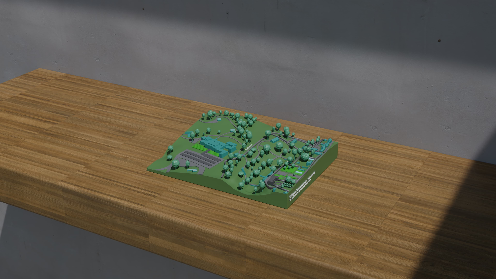
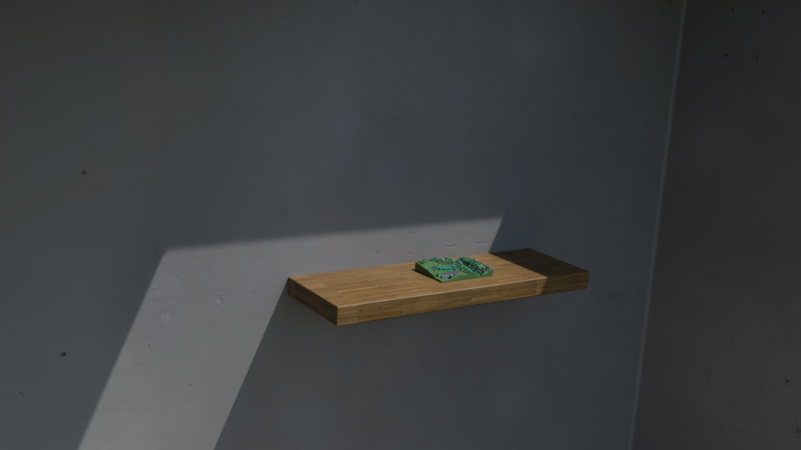
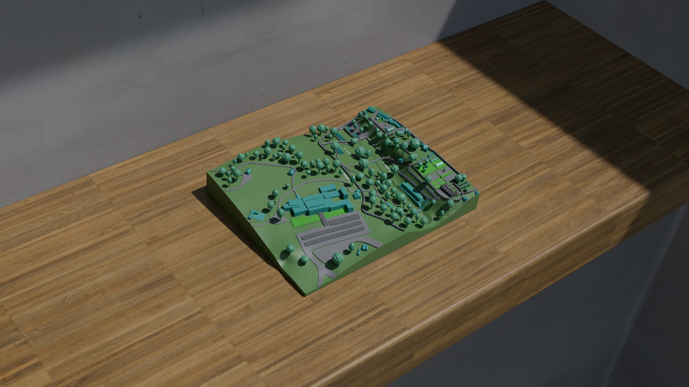
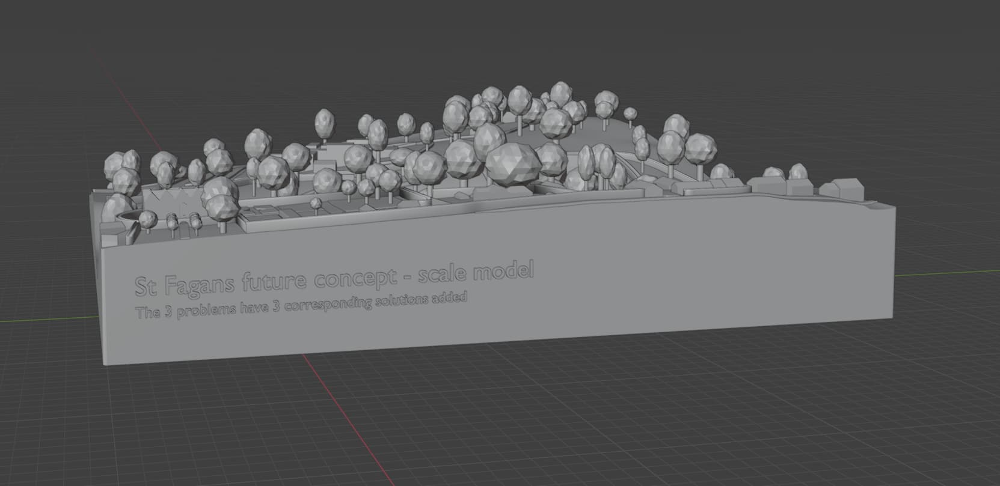

# blender-stfagans

A future vision of the St Fagans site with accessibility solutions added. Made in **Blender 5.0.1** for the [EESW Project](https://www.stemcymru.org.uk/).

### Details
The model is compried of 100s of different objects (trees, buildings, etc...) to make it easier to work with, but the objects are not stiched together. There are 2 versions:

* stfagans.blend - virtual geometry still exists with render objects included (easy to edit & render)
* stfagans-baked.blend - all real geometry, render objects have been deleted (difficult to edit). Use this for exporting as STL and splitting up the STL into multiple pieces if required.

Final STLs will be released in the released section.
Use 2-5% infill printing them (extra infill is unnecessary)

### Rendered Images

### Viewport Images

> **Licensing Note:** Contains public sector information licensed under the [Open Government Licence v3.0](https://www.nationalarchives.gov.uk/doc/open-government-licence/version/3/).

### Data Sources
* [Data Map Wales](https://datamap.gov.wales/maps/lidar-viewer/) was used for the LiDAR data.
* [geotiff2stl](https://github.com/ewandennis/geotiff2stl) was used for conversion to an STL.