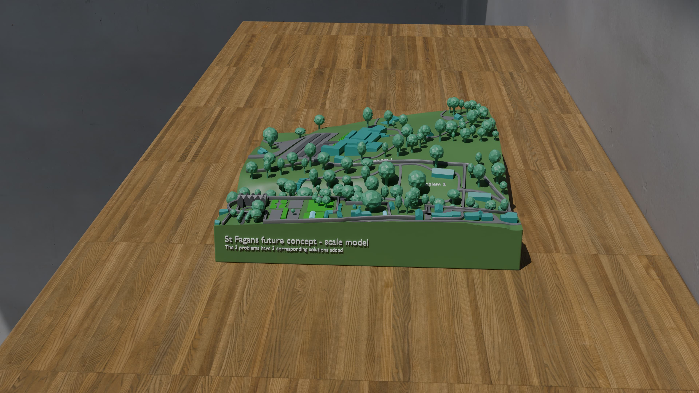
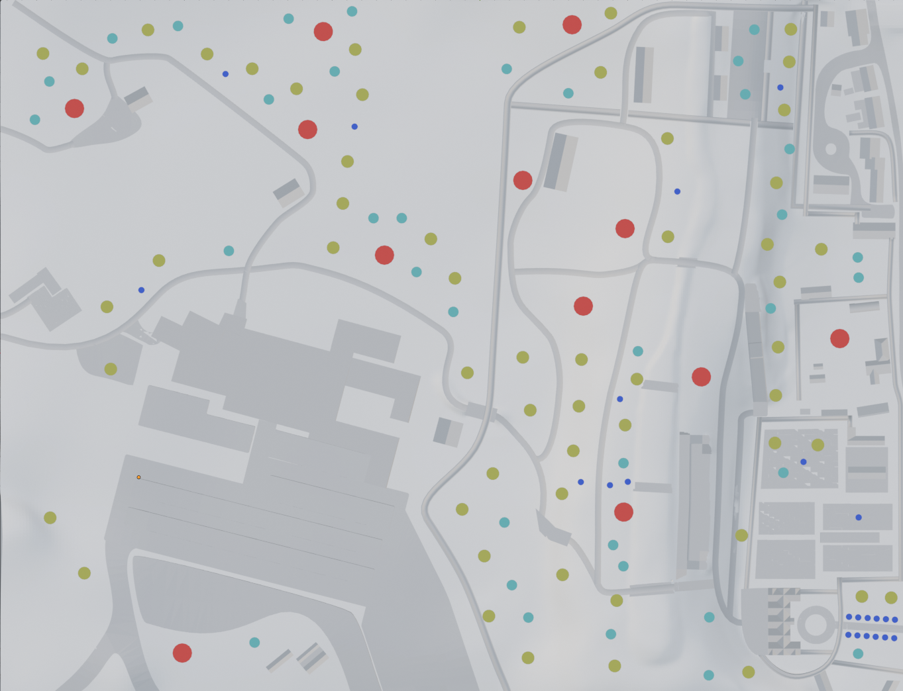
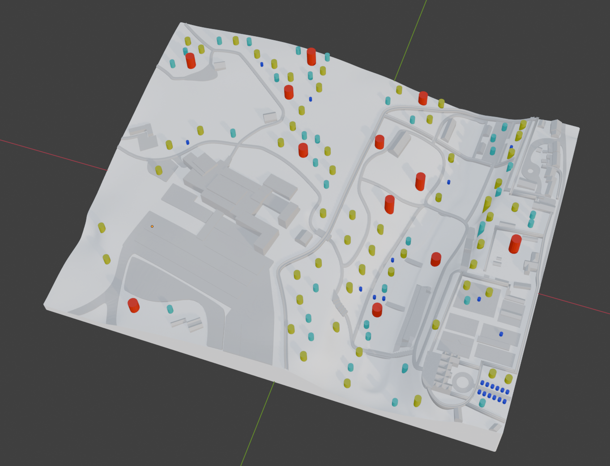
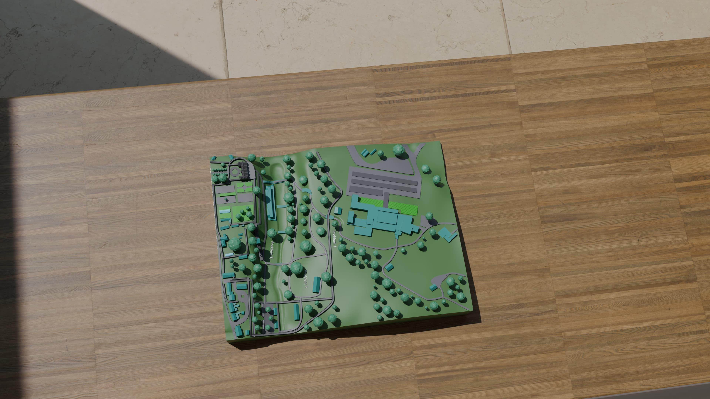
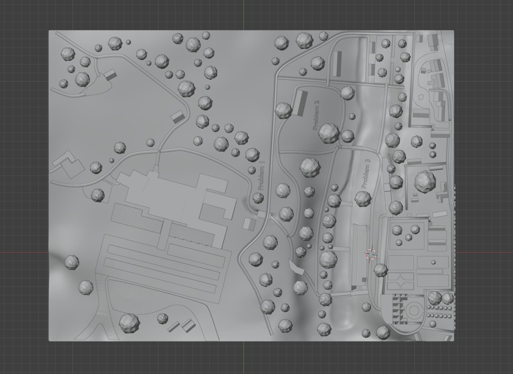
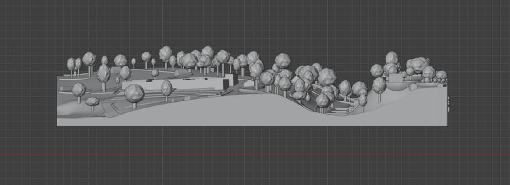

# blender-stfagans

A future vision of the St Fagans site with accessibility solutions added. Made in **Blender** for the [EESW Project](https://www.stemcymru.org.uk/).

### Model Details
The model is compried of 100s of different objects (trees, buildings, etc...) to make it easier to work with, but the objects are not stiched together. The file may take up to a few minutes to open, this is expected (likely becuase of the many modifiers). To apply all modifiers, press a (selects all objects) > ctrl+a > virtual geometry to mesh.

The models are scaled down to accurate size as of release 1.0.3, so you must export STLs with a 1000 scale multiplier from the .blend file to ensure they remain a consistent size in your slicer/3D print.

### 3D Printing Guide
To avoid having to re-print the entire model if one tree is broken, the trees are dsigned to fit into holes in the model. No glue should be necessary, the trees should just friction fit. The printed model is slightly smaller than the full model to allow for a larger final model size.

Final STLs will be released in the released section. Download the part 1-4 STLs & the tree catalogue, then print with the slicer settings below.

* Default required bed size: 235mm (you can scale down the model in your slicer with a smaller bed)
* Infill (main terrain): <4%
* Infill (trees): >40%

To calculate the scale factor for your print bed, divide your print bed width/length in mm by 235 (e.g. 220÷235 = 0.936170213).

When printing the trees, use wire cutters to cut the trees off the platform then match each size of tree to the correct holes. Use the images below as a guide to match the sizes of trees to the correct holes, or open the .blend file to match them.
 

|Small|Medium-small|Medium|Large|
|-----|------------|------|-----|
|Blue |Light blue  |Yellow|Red  |

### Rendered Images

### Viewport Images

### TODO
* Update printed tree catalogue to use array modifiers instead of instanced objects
* Update assets to reflect new model

### Data Sources
* [Data Map Wales](https://datamap.gov.wales/maps/lidar-viewer/) was used for the LiDAR data.
* [geotiff2stl](https://github.com/ewandennis/geotiff2stl) was used for conversion to an STL.

> **Licensing Note:** Contains public sector information licensed under the [Open Government Licence v3.0](https://www.nationalarchives.gov.uk/doc/open-government-licence/version/3/).
